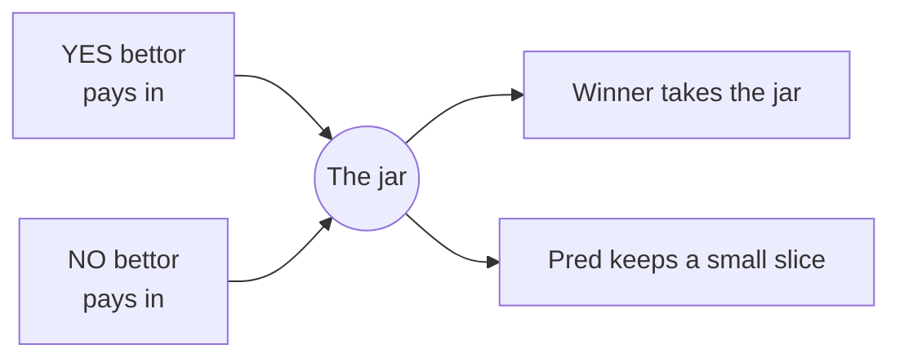

# What is Pred

Pred is a place to bet on yes-or-no questions about the real world.

Each market is one question with two sides, YES and NO. For example, "Will BTC
close above 100k on Friday?" You buy the side you believe in. When the question
resolves, the winning side gets paid and the losing side does not.

## Pred is the bookmaker

Picture someone holding a jar. One person bets YES and puts money in. Another
bets NO and puts money in. The winner takes the jar. Pred keeps a small slice for
running the table.



That is the whole idea. Pred is the house. It quotes prices, takes both sides,
and pays the winner with the loser's money. Pred never bets on an outcome itself.
It does not care whether YES or NO wins, only that it collects its slice on the
way through.

## A worked example

Say the fair odds of YES are 40 cents on the dollar. Pred quotes slightly above
fair on both sides:

```ts
yesPrice = 0.41   // fair 0.40 plus a 1 cent margin
noPrice  = 0.61   // fair 0.60 plus a 1 cent margin

// one person buys each side
collected = 0.41 + 0.61   // = 1.02
paidToWinner = 1.00
predKeeps = collected - paidToWinner   // = 0.02
```

One person buys YES, one buys NO. Pred collects 1.02, pays the winner 1.00, and
keeps 0.02. It does not matter who wins. The profit was locked the moment both
bets were placed.

That 2 cent margin is the **spread**. It is how the bookmaker earns.

## What you need to know to start

| Term | Meaning |
| --- | --- |
| Market | A yes-or-no question with a deadline |
| Price | A number from 0 to 1, the market's view of the odds. 0.65 means about 65% |
| Share | What you buy. A winning share pays 1 dollar, a losing share pays 0 |
| Spread | The small extra Pred adds on top of fair odds |

That is enough to place your first bet. The next page explains where the prices
come from.

## Next

- [How Prediction Markets Work](/basics/prediction-markets) covers prices and payouts.
- [Trading on Pred](/basics/trading) walks through placing a bet.
- [Using Leverage](/basics/leverage) explains betting bigger than your cash.
