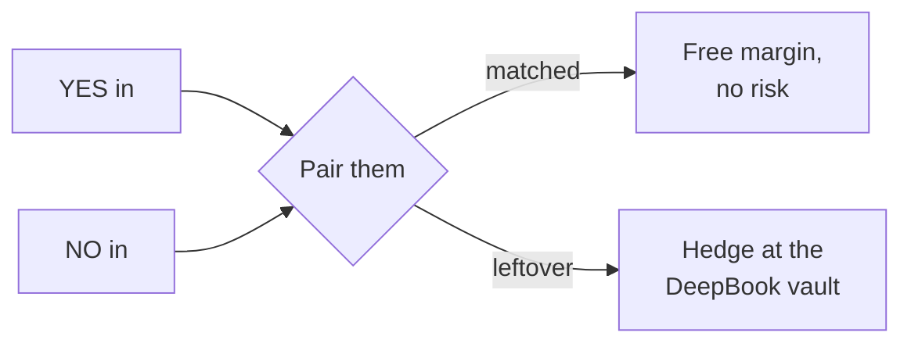

# The Betting Machine

The betting machine is Pred as a bookmaker. Its job is to earn a steady margin
without ever caring who wins.

## How it earns

Pred quotes a little more than the true odds on both sides. If fair YES is 40
cents and fair NO is 60 cents, Pred might sell YES for 41 and NO for 61.

```ts
collected    = 0.41 + 0.61   // = 1.02
paidToWinner = 1.00
margin       = 0.02          // locked the moment both bets land
```

A dollar and two cents comes in, a dollar goes out to the winner, two cents stays.
It does not matter who wins. The profit is locked the moment both bets are placed.
That margin is the spread.

## Pairing is free, the leftover is the risk

When a YES bettor and a NO bettor show up together, they cancel out. Pred keeps
its slice and carries no risk on that pair.



The only thing Pred worries about is the leftover: the side with more money on it
and nobody on the other side yet. Pred keeps every matched pair internal and
collects the full margin. Only the net leftover is sent to the DeepBook Predict
vault to be laid off, and laying it off costs a little. So Pred works to keep that
leftover small.

## Nudging the crowd

When the book leans one way, Pred does not spend money to fix it. It changes its
prices so the crowd fixes it.

Think of a lemonade stand low on lemon and overstocked on lime. Put lime on sale,
mark lemon up, and people buy lime until the stock balances itself.

Too many YES bets? Make NO a little cheaper and YES a little dearer. New bettors
drift to NO.

> Nudging one price down and the other up by the same amount keeps the total the
> same. So Pred earns the same margin either way. The nudge is free.

It pays off either way. The balancing side shows up and matches for free, or the
crowd keeps hitting the expensive side and pays a fatter margin for the extra risk
they hand Pred.

## The fee is not flat

Some bets are riskier, so Pred charges more on them.

| When | Why more |
| --- | --- |
| On longshots | A small error on a 2 cent bet is huge in percentage terms |
| Near the deadline | Less time for things to recover |
| When one side rushes in | A sudden surge often means somebody knows something |

The fee is always built fresh from the live odds. It is never a fixed number. The
exact formula is in [Pricing and the Spread](/technical/pricing).

## Capacity

Pred sets three thresholds on the bet imbalance.

| Imbalance | What Pred does |
| --- | --- |
| Inside the band | Steer only, carry it |
| Past the band | Hedge the excess at the vault |
| At the hard cap | Refuse exposing bets, accept only balancing ones |

The band scales with how much capital backs it and shrinks as the deadline nears.
The capital behind the carried imbalance is a fair, zero expected value bet, so it
averages out across many independent markets. Pred never concentrates it on a
single market or a single event.
