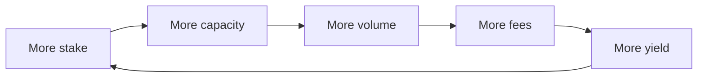

# The LP Pool

The LP pool is how outside stakers fund Pred's risk capital and get paid for it.

You stake USDC. That capital backs Pred's pools. In return you earn a share of
Pred's real fee revenue, plus yield from idle funds. You also stand behind the
risk, so when the pool covers a loss, stakers bear it. Real yield, real risk, no
emissions.

## What the pool backs

The staked USDC is the exact capital the rest of the system already needed: the
premium pool behind the leverage band, and the buffer behind the carried bet
imbalance, from [The Two Pots of Money](/economy/two-pots).

Instead of Pred funding that alone, LPs fund it and get paid. One pool backs both
risks. That is the starting design. Splitting it into tranches can come later.

## The flywheel

The pool size is not cosmetic. It directly sets how much leveraged trading Pred
can support, through the capital rule.

> Leveraged open interest is capped at about **7x** the pool. Equivalently, the
> pool must be at least **0.14x** the leveraged open interest.

More yield attracts more stake, and the loop turns again. Attracting stakers is
the entire reason the pool exists.

## How it works, in four parts

1. [Staking and NAV](/lp-pool/staking-and-nav), how your stake turns into shares
   and how those shares gain value.
2. [Fees and Losses](/lp-pool/fees-and-losses), how revenue lifts the pool and how
   losses lower it.
3. [Idle Yield](/lp-pool/yield), how idle capital earns extra in DeepBook Margin.
4. [Withdrawals and Cooldown](/lp-pool/withdrawals), how and when you can take
   capital out.

And finally, the honest part: [Risks](/lp-pool/risks).

> The pool is live on testnet with test funds, and the economy is still being
> tuned. Staking numbers, fee splits, and cooldowns can change as we learn from
> real flow.
