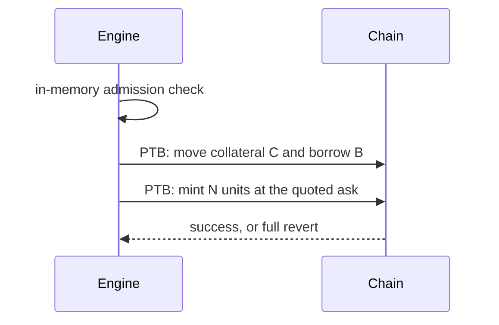

# Custody and Money Flow

Lending requires that the borrowed funds are not under the user's control while a
loan is open. DeepBook Predict gates every account action on the owner address,
with no trade-only delegation. So Pred is custodial by necessity, not by choice.

## Proxy accounts

Each user has a proxy account whose key Pred holds, encrypted, and which the user
never sees. The proxy owns the user's PredictManager and holds the lent funds.
Predict will let the owner withdraw everything, so the limit that keeps borrowed
money in place lives in Pred's backend, not on chain.

> No key is ever returned by an endpoint, shown in a UI, or written to a log. There
> is no export path. Keys are encrypted at rest.

## One PTB per action

The engine decides in memory, then signs one programmable transaction block per
action, so it is all-or-nothing.



A leveraged open, after the admission check passes, is one PTB:

```ts
// all-or-nothing
1. move user collateral C and reserved borrow B into the PredictManager
2. mint N units from the vault at the quoted ask
3. on failure anywhere, the whole PTB reverts, engine releases the reservation
```

The borrow `B` is an internal reservation against the pool, recorded in the ledger.
It is not a separate on-chain loan. Predict gates on owner equals sender, so the
proxy key signs.

## The withdrawal rule

A user can withdraw at most their equity, never the gross balance.

```ts
equity = collateral - debt - accruedFee
// withdrawal capped at equity, sent only to the registered address
```

The withdrawal is computed under the per-user lock, after any pending liquidation
resolves. This one rule is what stops borrowed money from leaving the system.

## Reconciliation

The engine ledger is the source of truth, but it is checked against reality. A
reconciliation job continuously compares engine balances to on-chain PredictManager
balances and alarms on any drift. Combined with idempotency keyed on transaction
digests and request ids, an ambiguous chain result settles exactly once and never
silently diverges.
