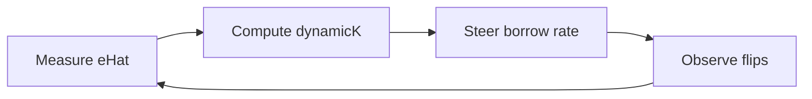

# The Elasticity Meter

Steering only works if traders respond to it. How strongly they respond is called
elasticity, and it is the one number Pred cannot assume. So Pred measures it live.

## Measuring it

Every steering decision emits a pair `(incentive, flipped)`, where `incentive` is
the rate differential offered to the balancing side and `flipped` is whether the
marginal opener took it. Pred regresses `flipped` on `incentive` through the
origin.

```ts
// two running sums, no history stored
Sxy += incentive * flipped
Sxx += incentive * incentive
eHat = Sxy / Sxx
```

This recovers true elasticity tightly, within about 35,000 fills, with a standard
error from the residual stream. Until that standard error is small, Pred is in a
calibration period and runs conservative.

## The control loop

Holding the imbalance at a fixed target needs steering strength roughly inversely
proportional to elasticity, because the crowd's response scales with elasticity.

```ts
dynamicK = clamp(K_ref * (e_ref / eHat), K_min, K_max)
```



The ceiling is left fixed. Tightening it would only add rejections. Pred adds
hysteresis so `dynamicK` does not chatter as `eHat` wobbles, and rate-limits how
fast it moves so traders are not whipsawed. `dynamicK = 4` was chosen because it
holds the imbalance near 11% while keeping rate volatility under about 5 percentage
points.

The honest limit: at very weak `eHat`, `dynamicK` saturates at `K_max` and the
residual rejection becomes structural. Past that point, the real lever is lower max
leverage, not more steering. That fallback is pre-committed, not improvised live.

## Why this is safe at any elasticity

This is the single most important property in the system.

> Because the ceiling caps the imbalance below the break no matter who flips,
> insolvency stays near zero at every elasticity. What moves with elasticity is the
> rejection rate, not the insolvency rate.

| elasticity | imbalance % | rejected % | insolvent % |
| --- | --- | --- | --- |
| 1.0 | ~14 | ~2 | 0 |
| 0.6 | ~15 | ~2 | 0 |
| 0.4 | ~17 | ~7 | 0 |
| 0.2 | ~20 | ~31 | 0 |
| 0.1 | ~22 | ~49 | 0 |

A wrong elasticity assumption costs user experience, which Pred sees and fixes
live. It never costs the pool.

## What to alarm on

Since solvency is structurally held, the alarms are about cost, not survival:

- Rejection rate climbing.
- `eHat` drifting down.
- Pool coverage, defined as `pool / (0.14 * OI)`, dropping toward 1.
